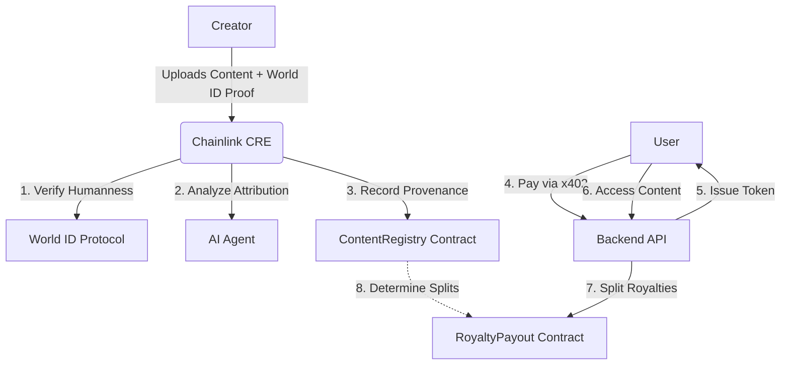

# BLIP: System Architecture

This document explains how **Chainlink CRE**, the **AI Attribution Agent**, **x402 Payment Layer**, and **World ID** integrate to create a trustless IP licensing and royalty ecosystem.

---

## 🏗 High-Level Architecture

BLIP follows a "Decentralized Referee" model. Instead of a central server deciding what is original or who is human, we use **Chainlink CRE** as a trusted executor to bridge complex off-chain logic with the blockchain.

---

## 🔍 Low-Level Implementation

### 1. World ID (Sybil Resistance)
*   **Role**: Ensures one human = one creator profile.
*   **Implementation**: Creators generate a ZK-proof using World ID's IDKit.
*   **CRE Integration**: The `cre-adapter` receives the proof (`merkle_root`, `nullifier_hash`, etc.) and verifies it off-chain using World's developer API. This allows World ID to be used on chains where it isn't results natively supported.

### 2. AI Attribution Agent (Provenance)
*   **Role**: Detects if content is original or derived from existing sources.
*   **Implementation**: A Python service (`analyzer.py`) that uses natural language heuristics to compare new submissions against a known corpus.
*   **CRE Integration**: CRE calls the agent's `/analyze` endpoint during the validation phase. It expects a **Confidence Score >= 70%** to approve registration.

### 3. Chainlink CRE (Decentralized Referee)
*   **Role**: The "source of truth" that orchestrates the off-chain checks and updates the blockchain.
*   **Implementation**: The `cre-adapter` (`index.ts`) serves as a custom external adapter.
*   **Atomic Validation**: It consolidates the results from World ID and the AI Agent. Only if **both** checks pass does it trigger the on-chain `validateContent(id, isHuman)` function.

### 4. x402 Payment Layer (Monetization)
*   **Role**: Enforces a protocol-level "Payment Required" status for digital content.
*   **Implementation**: 
    - **Middleware**: The `x402.middleware.ts` intercepts requests to premium content and checks for a valid cryptographic receipt.
    - **Service**: `payment.service.ts` uses HMAC-SHA256 to sign and verify receipts (tokens).
*   **Interaction**: When a user pays, the backend fetches the attribution list from `ContentRegistry` and triggers `RoyaltyPayout.distributeRoyalties()`.

---

## 🌉 The Integration Loop

1.  **Identity Layer**: World ID confirms the creator is a real human.
2.  **Integrity Layer**: AI Attribution Agent confirms the content's sources.
3.  **Authentication Layer**: Chainlink CRE attests to these facts on-chain.
4.  **Monetization Layer**: x402 ensures payment is collected before access and distributed accurately based on the on-chain provenance.

This unified stack ensures that **Human Creators** are identified, **Original Sources** are acknowledged, and **Royalties** are guaranteed without a central authority.
