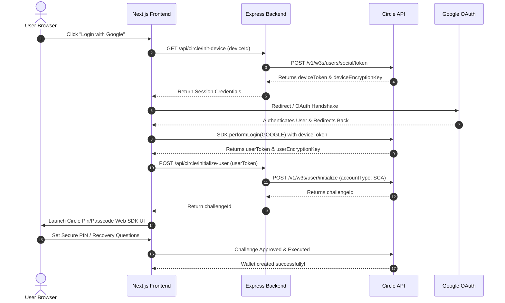

# Circle Programmable Wallets (User-Controlled) Integration Guide

This guide documents the technical architecture, setup procedures, API endpoints, and SDK integration flows for implementing **Circle User-Controlled Programmable Wallets** within the Blip Protocol.

User-Controlled Wallets give users absolute self-custody over their funds. Circle secures the private keys using advanced Threshold Cryptography (Multi-Party Computation / MPC), where key shares are split between Circle's secure infrastructure and the user's local device, authenticated via social login (Google, Apple) or email PIN/challenge setups.

---

## 1. Prerequisites & Sandbox Configuration

### Circle Developer Console Setup
1. Log in to the [Circle Developer Console](https://console.circle.com/).
2. Navigate to **Web3 Services → Wallets → User-Controlled → Configurator**.
3. Under **Authentication Methods → Social Logins**, select **Google** and paste your Web Client ID.
4. Go to **Configurator** and copy your **App ID** (`NEXT_PUBLIC_CIRCLE_APP_ID`).
5. Generate a Standard API Key (`CIRCLE_API_KEY`) and an Entity Secret (`CIRCLE_ENTITY_SECRET`).

### Google Cloud Console Setup (Social Login OAuth)
1. Log in to the [Google Cloud Console](https://console.cloud.google.com/).
2. Create a new project (e.g., "Blip Protocol Wallet").
3. Navigate to **Google Auth Platform** (OAuth Consent Screen):
   - **User Type**: External.
   - **Scopes**: Email, profile, openid.
4. Create an **OAuth Client ID**:
   - **Application Type**: Web Application.
   - **Authorized JavaScript Origins**: `http://localhost:3000`, `https://blip.xyz` (production).
   - **Authorized Redirect URIs**: `http://localhost:3000`, `https://blip.xyz` (or custom login redirect paths).
5. Copy the **Client ID** (`NEXT_PUBLIC_GOOGLE_CLIENT_ID`).

---

## 2. Technical Architecture & Onboarding Flow



---

## 3. Unified Backend Routes (Thin Proxy Wrapper)

The Express backend coordinates private API credentials securely. The frontend never accesses `CIRCLE_API_KEY` directly.

### 3.1 Initializing a User & Getting Session Tokens
- **Endpoint**: `POST /api/circle/init-user`
- **Request Body**: `{ userId: "blip_user_unique_uuid" }`
- **Logic**:
```typescript
// 1. Create a user entity if it doesn't exist
const userRes = await fetch("https://api.circle.com/v1/w3s/users", {
  method: "POST",
  headers: {
    "Content-Type": "application/json",
    Authorization: `Bearer ${process.env.CIRCLE_API_KEY}`,
  },
  body: JSON.stringify({ userId }),
});

// 2. Fetch session token for SDK challenges
const tokenRes = await fetch("https://api.circle.com/v1/w3s/users/token", {
  method: "POST",
  headers: {
    "Content-Type": "application/json",
    Authorization: `Bearer ${process.env.CIRCLE_API_KEY}`,
  },
  body: JSON.stringify({ userId }),
});
const data = await tokenRes.json();
// Returns: { userToken, encryptionKey }
```

### 3.2 Triggering User SCA Wallet Creation
- **Endpoint**: `POST /api/circle/create-wallet`
- **Request Body**: `{ userToken: "..." }`
- **Logic**:
```typescript
const response = await fetch("https://api.circle.com/v1/w3s/user/initialize", {
  method: "POST",
  headers: {
    "Content-Type": "application/json",
    Authorization: `Bearer ${process.env.CIRCLE_API_KEY}`,
    "X-User-Token": userToken,
  },
  body: JSON.stringify({
    idempotencyKey: crypto.randomUUID(),
    accountType: "SCA", // Smart Contract Account (allows gas sponsorship)
    blockchains: ["WLD-ETH-SEPOLIA", "BASE-ETH-SEPOLIA"],
  }),
});
const data = await response.json();
// Returns: { challengeId }
```

### 3.3 Listing User Wallets & Balances
- **Endpoint**: `GET /api/circle/wallets`
- **Headers**: `X-User-Token: <userToken>`
- **Logic**:
```typescript
// Get Wallets
const walletsRes = await fetch("https://api.circle.com/v1/w3s/wallets", {
  method: "GET",
  headers: {
    Authorization: `Bearer ${process.env.CIRCLE_API_KEY}`,
    "X-User-Token": userToken,
  },
});
const walletsData = await walletsRes.json();

// Get Balances for a specific wallet ID
const balanceRes = await fetch(`https://api.circle.com/v1/w3s/wallets/${walletId}/balances`, {
  method: "GET",
  headers: {
    Authorization: `Bearer ${process.env.CIRCLE_API_KEY}`,
    "X-User-Token": userToken,
  },
});
const balancesData = await balanceRes.json();
```

---

## 4. Frontend Web SDK Integration (`@circle-fin/w3s-pw-web-sdk`)

### 4.1 SDK Initialization & Redirect Recovery
The SDK requires cookies or local storage caching to maintain state across external Google OAuth redirections.

```typescript
import { useEffect, useRef, useState } from "react";
import { setCookie, getCookie } from "cookies-next";

export function useCircleWallet() {
  const sdkRef = useRef<any>(null);
  const [sdkReady, setSdkReady] = useState(false);

  useEffect(() => {
    import("@circle-fin/w3s-pw-web-sdk").then(({ W3SSdk }) => {
      const onLoginComplete = (error: any, result: any) => {
        if (error) {
          console.error("Circle login failed:", error);
          return;
        }
        // Save userToken and encryptionKey for transactions
        localStorage.setItem("userToken", result.userToken);
        localStorage.setItem("encryptionKey", result.encryptionKey);
      };

      const sdk = new W3SSdk({
        appSettings: { appId: getCookie("appId") || process.env.NEXT_PUBLIC_CIRCLE_APP_ID },
        loginConfigs: {
          deviceToken: getCookie("deviceToken"),
          deviceEncryptionKey: getCookie("deviceEncryptionKey"),
          google: {
            clientId: process.env.NEXT_PUBLIC_GOOGLE_CLIENT_ID,
            redirectUri: window.location.origin,
            selectAccountPrompt: true,
          }
        }
      }, onLoginComplete);

      sdkRef.current = sdk;
      setSdkReady(true);
    });
  }, []);

  return { sdk: sdkRef.current, sdkReady };
}
```

### 4.2 Executing Challenges (Interactive PIN / Security Settings)
When a challenge ID is returned by the backend, the client SDK displays the modal overlays for PIN entry or security question setup.

```typescript
const executeChallenge = (challengeId: string, userToken: string, encryptionKey: string) => {
  const sdk = sdkRef.current;
  if (!sdk) return;

  sdk.setAuthentication({ userToken, encryptionKey });
  sdk.execute(challengeId, (error: any, result: any) => {
    if (error) {
      console.error("Challenge execution failed:", error);
      return;
    }
    console.log("Challenge completed successfully!");
  });
};
```

---

## 5. Contract Execution & Transaction Relaying (CCTP Bridging)

To execute smart contract transactions (e.g., CCTP `depositForBurn` to start a bridge) using the user-controlled wallet, we trigger an outbound contract execution.

### 5.1 Initiating Contract Execution on Backend
Instead of a standard `writeContract` via MetaMask, the backend creates a transaction payload on Circle:

- **Endpoint**: `POST /api/circle/relay-bridge`
- **Request Body**:
```json
{
  "userToken": "...",
  "walletId": "...",
  "amount": "1000000",
  "destDomain": 6,
  "mintRecipient": "0x0000000000000000000000006dc4f7e7dc254777b8301ef3f89dd7757740c5f7"
}
```

- **Backend Logic**:
```typescript
const response = await fetch("https://api.circle.com/v1/w3s/user/transactions/contractExecution", {
  method: "POST",
  headers: {
    "Content-Type": "application/json",
    Authorization: `Bearer ${process.env.CIRCLE_API_KEY}`,
    "X-User-Token": userToken,
  },
  body: JSON.stringify({
    idempotencyKey: crypto.randomUUID(),
    walletId,
    contractAddress: "0x8FE6B999Dc680CcFDD5Bf7EB0974218be2542DAA", // World Chain Token Messenger
    abiFunctionSignature: "depositForBurn(uint256,uint32,bytes32,address)",
    abiParameters: [
      amount,            // uint256
      destDomain,        // uint32
      mintRecipient,     // bytes32
      "0x66145f38cBAC35Ca6F1Dfb4914dF98F1614aeA88" // WLD USDC Address
    ],
    fee: {
      type: "level",
      config: {
        feeLevel: "MEDIUM"
      }
    }
  }),
});
const data = await response.json();
// Returns: { challengeId } to be executed by SDK on the frontend
```

### 5.2 Executing and Confirming Transactions
1. The frontend receives the `challengeId` for the contract execution transaction.
2. The user executes the challenge on-screen via `sdk.execute(challengeId, callback)` by entering their secure PIN.
3. Circle signs and broadcasts the transaction, returning a transaction ID.
4. The backend monitors the transaction status using `GET /v1/w3s/transactions/{id}` or Webhook events (`transactions.outbound`). Once the state transitions to `COMPLETE`, the backend fetches the `txHash` and initializes CCTP attestation relaying!

---

## 6. Advanced Customizations & Operational Considerations

### 6.1 Gas Fee Station Integration
By utilizing **SCA (Smart Contract Account)** wallets (configured during `/user/initialize` using `accountType: "SCA"`), Circle allows app developers to sponsor gas fees for users.
- Configure this in the **Circle Developer Console** under **Gas Station**.
- When configured, user transactions on supported chains (like Base Sepolia) execute gaslessly from the user's perspective, with gas charges billed to the developer's pre-funded Circle gas account.

### 6.2 Key Recovery Policies
- **PIN Recovery**: Supported via user-defined Security Questions. If a user forgets their PIN, triggering a recovery challenge lets the SDK prompts them to answer security questions, reset their PIN, and regain key custody.
- **Social Account Access**: If a social login token is revoked or credentials are lost, the user must recover access directly with the identity provider (Google/Apple). Circle cannot recover or override social provider authentication.

### 6.3 Refreshing User Sessions
Session `userToken` values expire after **60 minutes**. Keep user sessions active by requesting a refresh token:
- **Backend Endpoint**: `POST /v1/w3s/users/token/refresh`
- **Body**: `{ refreshToken: "<USER_REFRESH_TOKEN>" }`
